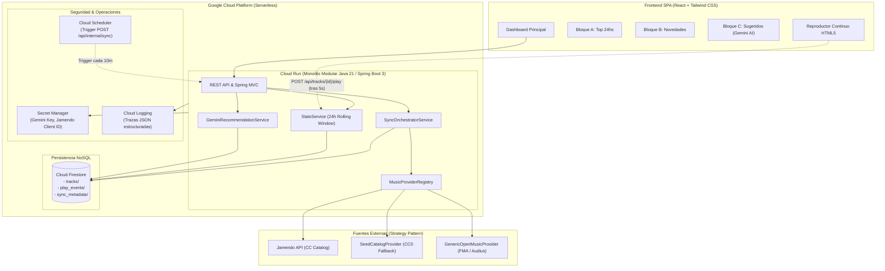
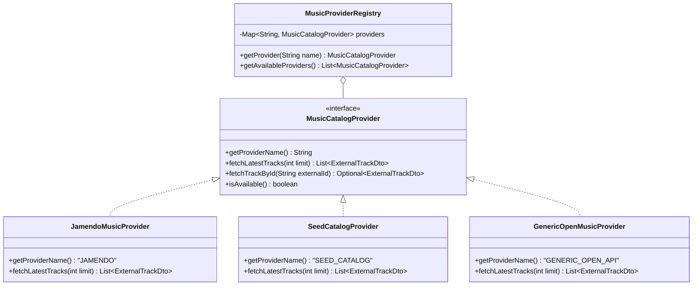

# Documento de Arquitectura Técnica & Guía para Entrevistas
## Plataforma de Descubrimiento de Música Sin Copyright (SoundWave)

Este documento detalla los principios de diseño, decisiones arquitectónicas y justificaciones técnicas del proyecto, diseñado para ser defendido en entrevistas técnicas para roles de **Java Backend Engineer**, **Cloud Engineer (GCP)** y **Full-Stack Developer**.

---

## 1. Visión General de la Arquitectura

---

## 2. Decisiones de Arquitectura Clave (Interview Talking Points)

### ¿Por qué un Monolito Modular en lugar de Microservicios?
* **Optimización de Costos y Free Tier**: En Cloud Run, cada contenedor JVM independiente consumiría entre 150 y 250 MB de memoria base. Tener 4 microservicios multiplicaría por 4 el consumo de GB-segundos y el riesgo de salir de la capa gratuita.
* **Cero Latencia Inter-Servicio**: La comunicación entre `SyncOrchestratorService`, `StatsService` y `GeminiRecommendationService` ocurre en memoria a través de interfaces de Java con latencia de nanosegundos (en lugar de llamadas REST/gRPC que añadirían serialización JSON y puntos de fallo).
* **Escalado a Cero Real**: Cuando no hay tráfico, el contenedor se apaga por completo, logrando un costo de **$0.00 al mes**.
* **Límites de Dominio Desacoplados**: Si en el futuro una parte del sistema requiriese escalar de forma aislada, la separación por paquetes y el uso de interfaces permite extraer el módulo a un microservicio en cuestión de horas.

---

### ¿Cómo se diseñó la extensibilidad para múltiples APIs de música?
Se aplicó el **Principio Abierto/Cerrado (OCP)** de SOLID mediante el patrón **Strategy** y un **Registry dinámico**:

1. **`MusicCatalogProvider`**: Define el contrato común para consultar catálogos externos.
2. **`MusicProviderRegistry`**: Spring detecta automáticamente cualquier nueva clase que implemente la interfaz y la registra en tiempo de arranque sin modificar una sola línea del orquestador.
3. **`ExternalTrackDto` & `Track`**: Se realiza una normalización canónica de los metadatos para que el modelo interno nunca dependa del esquema de terceros.

---

### ¿Cómo funciona el algoritmo de recomendación con Gemini AI?
A diferencia de los sistemas tradicionales basados únicamente en popularidad estadística (filtrado colaborativo básico), este sistema implementa **Curaduría Heurística con IA Explicable**:

1. **Clasificación por Tiers de Escucha (24h)**:
   - **`HEAVY_ROTATION`** (> 70% del rango de reproducciones): Temas consolidados en tendencia.
   - **`GROWING`** (25% - 70%): Artistas en crecimiento orgánico.
   - **`UNDERGROUND`** (< 25%): Joyas ocultas que necesitan visibilidad.
2. **Prompt Estructurado a Gemini**:
   Se envía un payload JSON con las canciones y su distribución de escuchas, instruyendo al modelo para que favorezca gemas del rango `UNDERGROUND` y `GROWING` con coherencia estilística hacia las tendencias más escuchadas.
3. **Salida Explicable (*Explainable AI*)**:
   Gemini devuelve para cada pista una justificación humana de 1-2 oraciones explicando *por qué* el usuario debería escucharla hoy, conectando emocionalmente con el oyente.
4. **Motor de Fallback Inteligente**:
   Si no se configura una API key de Gemini o la red falla, el sistema conmuta automáticamente a un motor heurístico local que calcula afinidad y redacta razonamientos contextuales sin degradar la UI.

---

## 3. Seguridad y Operaciones

| Componente | Rol en la Arquitectura |
| :--- | :--- |
| **GCP Secret Manager** | Almacena `gemini-api-key` y `jamendo-client-id`. Las credenciales nunca se hardcodean ni se incluyen en imágenes Docker; se resuelven en runtime. |
| **Cloud Logging** | Registro estructurado en formato JSON con niveles de severidad (`INFO`, `WARN`, `ERROR`) para trazabilidad e integración nativa con Cloud Monitoring. |
| **Cloud Scheduler** | Ejecuta un cron automatizado cada 10 minutos (`*/10 * * * *`) autenticado vía token OIDC que invoca `POST /api/internal/sync`. |
| **Firestore NoSQL** | Base de datos serverless con transacciones atómicas para incrementar contadores de escuchas sin colisiones concurrentes. |

---

## 4. Matriz de Respuestas Rápidas para Entrevistas

| Pregunta | Respuesta Clave |
| :--- | :--- |
| **¿Por qué Java 21?** | Por su tipado seguro, Virtual Threads, ecosistema maduro de Spring Boot 3 y soporte oficial de Google Cloud SDK. |
| **¿Por qué Serverless en GCP?** | Alta disponibilidad, cero administración de infraestructura y costo $0.00 en reposo gracias al escalado a cero de Cloud Run. |
| **¿Qué pasa si una API externa de música cae?** | El orquestador aísla el fallo por proveedor, registra el evento en Cloud Logging y continúa sincronizando las fuentes restantes, mientras Firestore sigue respondiendo el catálogo disponible. |
