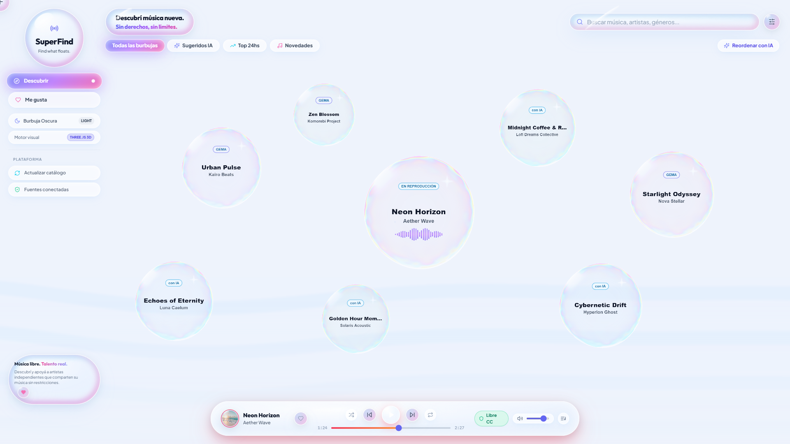
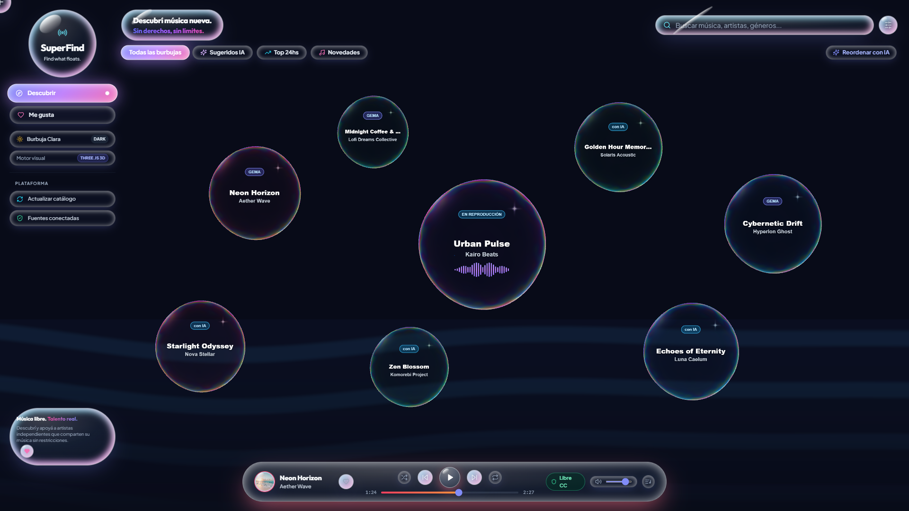
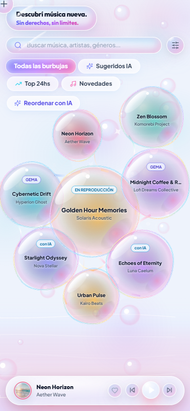
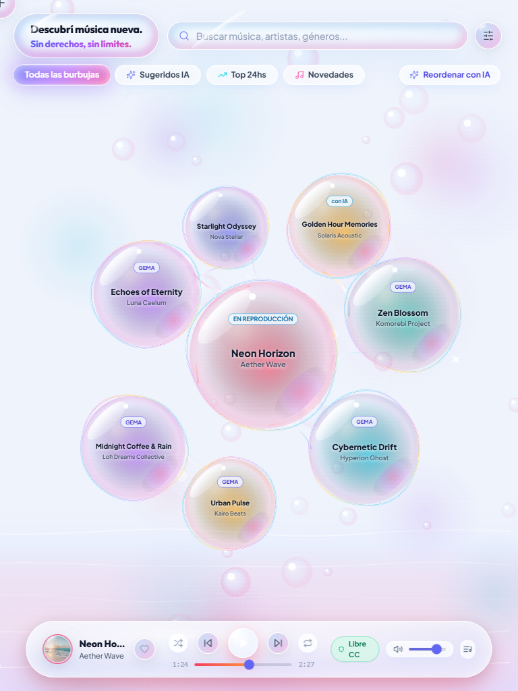

# 🎵 Superfind - Plataforma de Descubrimiento de Música Sin Copyright (Java + GCP + Gemini)

> Plataforma web de descubrimiento musical orientada a contenido **Creative Commons / Royalty-Free**, construida con **Java 21**, **Spring Boot 3**, infraestructura Serverless en **Google Cloud Platform (GCP)** e integración con **Gemini AI** para recomendaciones inteligentes y explicables.


---

## 🌐 Demo en vivo

**▶ [Abrir la demo interactiva](https://romacab07.github.io/Superfind/)**

Demo estática publicada en **GitHub Pages**. Corre 100% en el navegador sobre un catálogo curado de música Creative Commons, así que podés explorar el mundo de burbujas, la constelación, el cambio de tema y el reproductor **sin clonar el repo, sin backend y sin API keys**.

[](https://romacab07.github.io/Superfind/)
[](https://romacab07.github.io/Superfind/)

| Mobile | Tablet |
| :---: | :---: |
|  |  |

> En la demo, cada llamada a `/api` se resuelve contra un catálogo local (`frontend/src/services/demoCatalog.js`) en vez del backend, y el header muestra el badge **Demo · catálogo simulado** para dejar en claro que los datos son de muestra. La demo se publica automáticamente con [`.github/workflows/deploy-pages.yml`](.github/workflows/deploy-pages.yml) en cada push a `master`.

---

## 🚀 Características Principales

1. **Frontend MVP Visual (3 Bloques Clave)**:
   - **Bloque A: "Top últimas 24hs"**: Ranking en tiempo real de las canciones más escuchadas del último día con medidor de popularidad.
   - **Bloque B: "Novedades"**: Últimos lanzamientos sincronizados automáticamente desde catálogos abiertos de música libre de derechos.
   - **Bloque C: "Sugeridos" (Gemini AI)**: Recomendaciones con **razonamiento explicable (*Explainable AI*)** que rescata artistas emergentes y joyas ocultas según patrones de escucha.
   - **Reproductor de Audio Flotante**: Reproducción continua de streaming MP3, barra de progreso interactiva, control de volumen y telemetría automática (registra reproducción tras 5 segundos de escucha).

2. **Arquitectura Backend (Monolito Modular Cloud-Native)**:
   - **Patrón Strategy & Registry (`MusicCatalogProvider`)**: Permite integrar múltiples APIs externas de música (Jamendo, Seed Catalog, Free Music Archive, Audius) respetando el principio Open/Closed de SOLID.
   - **Sincronizador Automatizado**: Proceso programado cada 10 minutos (compatible con Cloud Scheduler) que audita e ingiere nuevas pistas sin duplicados.
   - **Motor de Recomendación Dual**: Conexión directa a Gemini API con fallback heurístico inteligente garantizado.

3. **Infraestructura Serverless en Google Cloud Platform (GCP)**:
   - **Cloud Run**: Escalado a **cero instancias** en reposo para **costo $0.00/mes** dentro de la capa gratuita.
   - **Cloud Firestore**: Base de datos NoSQL para pistas, auditoría de escuchas y estados de sincronización.
   - **Secret Manager**: Inyección segura de API Keys en tiempo de ejecución.
   - **Cloud Scheduler & Cloud Logging**: Disparadores OIDC y observabilidad estructurada en JSON.
   - **Infraestructura como Código**: Scripts de **Terraform** (`infra/main.tf`) listos para desplegar en 1 clic.

---

## 🛠️ Tecnologías Utilizadas

| Capa | Tecnología |
| :--- | :--- |
| **Backend** | Java 21 LTS, Spring Boot 3.4.3, Spring MVC, Spring Actuator, Springdoc OpenAPI (Swagger UI) |
| **Cloud & Storage** | GCP Cloud Run, Cloud Firestore NoSQL, Secret Manager, Cloud Scheduler, Cloud Logging |
| **Inteligencia Artificial** | Google Gemini API (Modelos 1.5 Flash / 2.0 Flash) |
| **Frontend** | React 18, Vite, Tailwind CSS, Lucide React, Axios |
| **Contenedores & DevOps**| Docker, Docker Compose, Terraform, Google Cloud Build |

---

## 📂 Estructura del Proyecto

```
Superfind/
├── backend/                         # Backend Java 21 / Spring Boot 3
│   ├── src/main/java/com/soundwave/musicdiscovery/
│   │   ├── config/                  # GCP, Gemini, CORS, Swagger OpenAPI
│   │   ├── controller/              # Endpoints REST (Tracks, Recommendations, Sync, Health)
│   │   ├── dto/                     # Objetos de transferencia y contratos API
│   │   ├── model/                   # Modelos de dominio (Track, PlayEvent, SyncStatus)
│   │   ├── provider/                # Strategy Pattern & Registry para APIs de música
│   │   │   ├── impl/                # JamendoMusicProvider, SeedCatalogProvider, GenericOpen
│   │   ├── repository/              # Repositorios (Firestore y perfiles InMemory)
│   │   └── service/                 # SyncOrchestrator, GeminiRecommendation, Stats, TrackService
│   ├── Dockerfile                   # Docker multi-stage Java 21 JRE Alpine
│   └── pom.xml
│
├── frontend/                        # Frontend React + Tailwind CSS
│   ├── src/
│   │   ├── components/              # Navbar, Hero, Bloque A, Bloque B, Bloque C, AudioPlayer, Modals
│   │   ├── services/api.js          # Cliente Axios
│   │   ├── App.jsx                  # Orquestador de vistas
│   │   └── index.css                # Glassmorphism dark mode
│   ├── Dockerfile                   # Docker multi-stage Nginx
│   └── package.json
│
├── infra/                           # Infraestructura como Código (IaC)
│   ├── main.tf                      # Recursos GCP (Cloud Run, Firestore, Secrets, Scheduler)
│   ├── variables.tf
│   └── outputs.tf
│
├── .github/workflows/
│   └── deploy-pages.yml             # Publica la demo estática en GitHub Pages
├── music/                           # Carpeta opcional para tus propios audios (ignorada por Git)
├── docker-compose.yml               # Despliegue local completo en 1 comando
├── .env.example                     # Variables de entorno opcionales (Jamendo, Gemini, música local)
├── deploy.sh / deploy.ps1           # Scripts de despliegue a GCP Cloud Run
├── ARCHITECTURE.md                  # Documentación de diseño y arquitectura del sistema
└── README.md
```

---

## 🚀 Cómo Ejecutar el Proyecto

### Opción 1: Ejecución Local Rápida (Recomendada para Desarrollo)

#### 1. Backend (Spring Boot en puerto 8080)
```bash
cd backend
./mvnw.cmd spring-boot:run
```
> El backend iniciará con el perfil `local` en memoria y sincronizará de inmediato el catálogo inicial garantizado.
> - **Swagger UI**: `http://localhost:8080/swagger-ui.html`
> - **Health Check**: `http://localhost:8080/api/health`

#### 2. Frontend (React en puerto 5173)
```bash
cd frontend
npm install
npm run dev
```
> Abre tu navegador en `http://localhost:5173`.

---

### Opción 2: Ejecución con Docker Compose (Contenedores Completos)

```bash
docker compose up --build
```
- **Frontend Web**: `http://localhost:3000`
- **Backend API**: `http://localhost:8080`

#### Variables de entorno opcionales

Copiá `.env.example` a `.env` y completá lo que necesites. **Ninguna es obligatoria**: sin ninguna variable la app arranca igual y sirve el catálogo semilla.

| Variable | Qué habilita |
| :--- | :--- |
| `JAMENDO_CLIENT_ID` | Sincronización real desde el catálogo abierto de Jamendo |
| `GEMINI_API_KEY` | Recomendaciones con Gemini AI (sin ella se usa el motor heurístico de fallback) |
| `LOCAL_MUSIC_PATH` | Carpeta con tus propios audios (mp3 / wav / m4a / ogg). Si queda vacía, el provider `LOCAL_DISK` permanece inactivo y no se escanea ningún directorio del host |

---

### Opción 3: Demo estática en local (sin backend)

```bash
cd frontend
npm install
npm run build:demo
npm run preview
```
> Genera la misma build que se publica en GitHub Pages: catálogo curado embebido, cero llamadas al backend.

---

## 🌐 Endpoints REST Principales

| Método | Endpoint | Descripción |
| :--- | :--- | :--- |
| `GET` | `/api/tracks/top-24h` | **Bloque A**: Canciones más reproducidas en las últimas 24 horas |
| `GET` | `/api/tracks/recent` | **Bloque B**: Lanzamientos más recientes sincronizados |
| `GET` | `/api/recommendations/gemini` | **Bloque C**: Recomendaciones inteligentes generadas por Gemini AI |
| `POST` | `/api/tracks/{id}/play` | Registra evento de reproducción e incrementa estadísticas |
| `POST` | `/api/internal/sync` | Ejecuta sincronización multi-proveedor (Trigger Cloud Scheduler) |
| `GET` | `/api/internal/providers` | Lista proveedores de música detectados y su disponibilidad |
| `GET` | `/api/health` | Liveness/readiness probe de Cloud Run |

---

## ☁️ Despliegue en Google Cloud Platform (GCP)

### 1. Despliegue con Terraform
```bash
cd infra
terraform init
terraform apply -var="project_id=TU_PROJECT_ID_GCP"
```

### 2. Despliegue con Scripts Automatizados
```bash
# En Windows PowerShell:
.\deploy.ps1 -ProjectId "tu-proyecto-gcp" -Region "us-central1"

# En Linux/macOS:
chmod +x deploy.sh
./deploy.sh "tu-proyecto-gcp" "us-central1"
```

## 📚 Arquitectura y Diseño Técnico
Consulta el archivo [`ARCHITECTURE.md`](ARCHITECTURE.md) para acceder a los diagramas de arquitectura detallados, modelo de datos y flujo de componentes.
