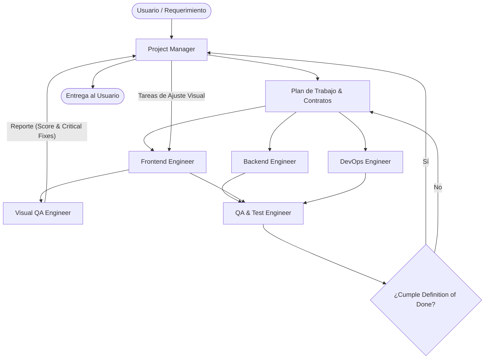

# Equipo de Agentes Especializados — SoundWave

Este documento describe la estructura organizativa, responsabilidades, herramientas y flujos de trabajo de los agentes especializados configurados para el proyecto **SoundWave**.

---

## 1. Mapa de Agentes

| Agente | Nombre de Invocación | Especialidad / Rol Principal | Herramientas Clave |
| :--- | :--- | :--- | :--- |
| **Project Manager** | `project_manager` | Coordinación de tareas, desglose funcional, gobernanza de arquitectura y validación de DoD. | Invocación de subagentes, inspección de código, gestión de planes. |
| **Backend Engineer** | `backend_engineer` | Java 21, Spring Boot 3.4+, Monolito Modular, Providers (Jamendo), Gemini AI, Firestore y DTOs. | Edición de código, compilación (`mvnw`), tests unitarios/integración (`JUnit 5`). |
| **Frontend Engineer** | `frontend_engineer` | React 18, Vite, Tailwind CSS, Canvas / Visualizador (Bubble World), Streaming de Audio y UI/UX. | Edición de componentes React/CSS, build de Vite (`npm run build`). |
| **Cloud & DevOps** | `devops_cloud_engineer` | GCP Serverless (Cloud Run, Firestore, Scheduler, Secret Manager), Terraform IaC y Docker. | Terraform (`infra/main.tf`), Dockerfiles, Docker Compose, configs GCP. |
| **Visual QA Engineer**| `visual_qa` | Auditoría visual, benchmarking de diseño, fidelidad estética (burbujas, materiales, paletas, layout, responsive) y generación de reportes con VISUAL SCORE y lista CRITICAL sin modificar código. | Inspección de frontend/CSS/Canvas/DOM, lectura de referencias de diseño y tokens visuales (Read-Only). |
| **QA & Test Engineer**| `qa_test_engineer` | Ejecución de suites de prueba, verificación de contratos de API y auditoría de seguridad/secretos. | Ejecución de `mvnw test`, `npm run build`, análisis estático de seguridad. |

---

## 2. Definición Detallada por Agente

### 2.1 Project Manager (`project_manager`)
* **Objetivo**: Garantizar que los requerimientos se implementen de manera coherente respetando la arquitectura del monolito modular y las normas de `AGENTS.md`.
* **Responsabilidades**:
  * Desglosar requerimientos del usuario en subtareas claras.
  * Asignar y orquestar a `backend_engineer`, `frontend_engineer`, `devops_cloud_engineer`, `visual_qa` y `qa_test_engineer`.
  * Recibir reportes de diagnóstico y correcciones visuales de `visual_qa` y transformarlos en tareas concretas para `frontend_engineer`.
  * Validar la compatibilidad entre contratos de API (`docs/api-contracts.md`) y modelos de datos (`docs/data-model.md`).
  * Comprobar el cumplimiento estricto del Criterio de Finalización (*Definition of Done*).

### 2.2 Senior Backend Engineer (`backend_engineer`)
* **Objetivo**: Desarrollar la lógica del servidor, ingesta de catálogos musicales y motor de recomendaciones IA.
* **Responsabilidades**:
  * Implementar proveedores de catálogo mediante el patrón Strategy (`MusicCatalogProvider` & `MusicProviderRegistry`).
  * Mantener el servicio de sincronización resiliente (`SyncOrchestratorService`).
  * Administrar la curaduría inteligente con Gemini AI (`GeminiRecommendationService`) aplicando los 3 tiers (*Heavy Rotation*, *Growing*, *Underground*) y el motor de fallback.
  * Gestionar la persistencia dual: `InMemoryTrackRepository` (local/tests) y `FirestoreTrackRepository` (perfil `gcp`).
  * Ejecutar y validar tests (`.\mvnw.cmd test`, `.\mvnw.cmd compile`).

### 2.3 Senior Frontend Engineer (`frontend_engineer`)
* **Objetivo**: Construir una interfaz moderna, reactiva, accesible y visualmente atractiva para el descubrimiento musical.
* **Responsabilidades**:
  * Mantener y evolucionar el reproductor continuo (`Player.jsx`, `AudioPlayerBar.jsx`) con soporte de audio streaming MP3 y disparo de eventos de escucha a los 5 segundos (`POST /api/tracks/{id}/play`).
  * Diseñar y optimizar la vista interactiva de constelación musical (`BubbleWorld.jsx`, `BubbleConstellation.jsx`, `Bubble.jsx`).
  * Implementar las vistas de descubrimiento: Top 24h, Novedades y Sugeridos (Gemini AI).
  * Aplicar las correcciones visuales y de diseño canalizadas por `project_manager` a partir de las auditorías de `visual_qa`.
  * Validar compilación de producción (`npm run build`).

### 2.4 Cloud & DevOps Engineer (`devops_cloud_engineer`)
* **Objetivo**: Mantener la infraestructura serverless en GCP con costo $0 en reposo y despliegues reproducibles.
* **Responsabilidades**:
  * Administrar la configuración de Cloud Run (`min-instances: 0`, `max-instances: 5`).
  * Mantener el disparador programado de Cloud Scheduler (`POST /api/internal/sync` cada 10 min).
  * Gestionar secretos en Secret Manager (`gemini-api-key`, `jamendo-client-id`).
  * Mantener la infraestructura en Terraform (`infra/main.tf`) y contenedores (`docker-compose.yml`).

### 2.5 QA & Test Engineer (`qa_test_engineer`)
* **Objetivo**: Asegurar la calidad, estabilidad y seguridad del código antes de cada entrega o commit.
* **Responsabilidades**:
  * Ejecutar suites completas de pruebas unitarias e integración en backend (`mvnw test`).
  * Validar el build de producción del frontend (`npm run build`).
  * Verificar esquemas JSON de requests y responses contra `docs/api-contracts.md`.
  * Auditar que no existan secretos ni credenciales hardcodeadas en código ni en logs.

### 2.6 Visual QA Engineer (`visual_qa`)
* **Objetivo**: Comparar la implementación visual actual del frontend contra la referencia visual de diseño y emitir correcciones concretas y accionables.
* **Regla de Operación**: **No modifica código inicialmente** (agente de auditoría y diagnóstico read-only).
* **Dimensiones de Análisis**:
  1. **Composición (Composition)**: Equilibrio visual, porcentaje de ocupación del viewport, jerarquía y distribución de bloques.
  2. **Tamaños (Scale & Dimensions)**: Proporciones relativas de radios de burbujas, escala tipográfica, escala de controles y carátulas.
  3. **Spacing**: Consistencia de padding, margin, gaps de flex/grid y ritmos espaciales.
  4. **Colores (Color System)**: Armonía de paleta, saturación, degradados y relaciones de contraste.
  5. **Burbujas (Bubble Realism & Materials)**: Realismo de materiales, reflejos (rim light), elasticidad orgánica vs. rigidez geométrica y shaders/canvas.
  6. **Iluminación (Lighting & Highlights)**: Fuentes de luz, reflejos especulares en glassmorphism y resplandor ambiental (*glow*).
  7. **Profundidad (Atmospheric Depth)**: Capas z-index, desenfoque de fondo (*backdrop blur*), partículas de fondo y sensación 2.5D/3D.
  8. **Densidad (Density & Distribution)**: Cobertura equilibrada del área visible evitando vacíos excesivos o apiñamiento.
  9. **Navegación (Navigation)**: Integración del header/sidebar/dock, coherencia de burbujas de navegación y filtros.
  10. **Player (Audio Player)**: Integración del dock inferior, barra de progreso, artwork y controles de transporte.
  11. **Responsive**: Adaptabilidad estética en resoluciones Mobile (375px-430px), Tablet (768px-1024px) y Desktop (1280px-1920px+).
  12. **Dark Mode**: Armonía cromática, luminancia de fondos oscuros y legibilidad (WCAG).
  13. **Movimiento (Motion & Physics)**: Fluidez en animación de partículas, oscilación flotante orgánica y transiciones hover/active.
  14. **Consistencia Visual (Visual Consistency)**: Cohesión de radios de borde (*border-radius*), tipografías, badges y propagación de paleta del artwork al material de burbuja.
* **Estructura Estricta de Salida**:
  ```text
  VISUAL SCORE: 72/100

  Composition:        81
  Bubble realism:     58
  Color system:       64
  Navigation:         76
  Spacing:            71
  Player:             83
  Album integration:  42
  Dark mode:          78

  CRITICAL:
  1. Music bubbles occupy only 38% of viewport.
  2. Navigation bubbles are visually detached.
  3. Album artwork palette is not propagated to bubble material.
  4. Active bubble is too geometric.
  5. Background has insufficient atmospheric depth.

  ACTIONABLE SPECIFICATIONS FOR FRONTEND ENGINEER:
  - Component: src/components/BubbleWorld.jsx
    Issue: Music bubbles occupy only 38% of viewport.
    Fix: Aumentar el radio de distribución y escala base de partículas en el canvas/viewport a un 65-75% de ocupación.
  - Component: src/components/Bubble.jsx
    Issue: Album artwork palette is not propagated to bubble material.
    Fix: Extraer paleta dominante con paletteExtractor.js e inyectar acento en background radial-gradient y box-shadow glow.
  ```
* **Flujo de Interacción**:
  * `visual_qa` entrega el diagnóstico y score a `project_manager`.
  * `project_manager` revisa y transfiere las correcciones técnicas al `frontend_engineer`.

---

## 3. Protocolo de Trabajo y Flujo de Comunicación



---

## 4. Criterio de Finalización (Definition of Done)

Ninguna tarea se da por concluida hasta verificar:
- [x] Código implementado, modular y limpio.
- [x] Backend compila sin errores (`.\mvnw.cmd compile`).
- [x] Frontend compila en producción sin errores (`npm run build`).
- [x] Tests unitarios e integración pasando al 100% (`.\mvnw.cmd test`).
- [x] Auditoría visual aprobada por `visual_qa` (sin bloqueos críticos).
- [x] Cero secretos o tokens en código fuente o logs.
- [x] Compatibilidad dual preservada (perfiles `local` y `gcp`).
- [x] Documentación actualizada en caso de cambios arquitectónicos.
